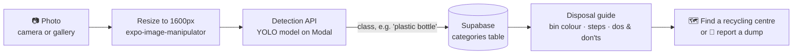

<div align="center">

# ♻️ EcoShift

**Point your phone at a piece of waste. Learn what it is, which bin it belongs in, and where to drop it off.**

A React Native (Expo) app that helps people in Mumbai sort waste properly, find nearby recycling centres, and report illegal dumps to the right authority.


</div>

---

## Contents

- [Why EcoShift](#why-ecoshift)
- [Features](#features)
- [How a scan works](#how-a-scan-works)
- [Tech stack](#tech-stack)
- [Getting started](#getting-started)
- [Database setup](#database-setup)
- [Project structure](#project-structure)
- [Contributing](#contributing)
- [Known issues](#known-issues)
- [Team](#team)
- [License](#license)

---

## Why EcoShift

A lot of household waste could be recycled, but it ends up mixed in one bin because people don't know **what goes where** or **who takes it**. EcoShift turns that into a 10-second habit:

1. **Scan** the item.
2. **Get** the right bin colour, step-by-step disposal advice, and the local recycling route (kabadiwalas, municipal dry-waste centres, recyclers).
3. **Drop it off** at a verified recycling centre on the map, or **report** a garbage dump straight to BMC.

---

## Features

| | Feature | What it does |
|---|---|---|
| 📷 | **Waste scanner** | Take a photo, upload one from the gallery, or pick from a catalogue of **59 items**. A YOLO model identifies the item and opens its disposal guide. |
| 🗑️ | **Disposal guide** | Bin colour (yellow / blue / green / red / grey), how to dispose of it, recycling channels in India, environmental and economic impact, and dos & don'ts. |
| 🗺️ | **Map-first recycling map** | Full-screen map with recycling centres and reported dumps, filter chips, street/satellite layers, "locate me", and a swipe-up list sorted **nearest first**. |
| 🏢 | **Recycling centres directory** | Searchable list of centres with the materials they accept, opening hours, call and directions buttons. |
| 🚨 | **Report a dump** | A 3-step flow (photo → details → send) with GPS location. Sends a ready-written complaint by **email** (BMC, Swachh Bharat, CPCB or MPCB) or **WhatsApp** (BMC's grievance line) and pins it on the community map. |
| 📰 | **Stories & studies** | Curated, real articles from WHO, UNEP, US EPA, Down To Earth, Mongabay India and more, filterable by waste type. |
| 🕓 | **Scan history & impact** | Every scan is saved with points, so users can see their impact over time. |
| 👤 | **Accounts** | Email/password and Google sign-in via Supabase, password reset, and a **guest mode** that works without an account. |

---

## How a scan works



If detection fails or finds nothing, the user can still pick the item from the 59-item catalogue.

---

## Tech stack

| Layer | Tools |
|---|---|
| App | [Expo SDK 57](https://docs.expo.dev/), React Native 0.86, React 19 |
| Navigation | React Navigation 7 (bottom tabs + native stack) |
| Backend | [Supabase](https://supabase.com/): Auth (email, Google OAuth) and Postgres (`categories`, `markers`) |
| Waste detection | YOLO object-detection model served on [Modal](https://modal.com/) |
| Maps | [Leaflet](https://leafletjs.com/) in a WebView with OpenStreetMap and Esri tiles (no API key needed) |
| Device APIs | `expo-camera`, `expo-image-picker`, `expo-location`, `expo-image-manipulator`, `expo-file-system`, `expo-secure-store` |

---

## Getting started

### Prerequisites

- [Node.js](https://nodejs.org/) 18 or newer
- The **Expo Go** app on your phone ([Android](https://play.google.com/store/apps/details?id=host.exp.exponent) / [iOS](https://apps.apple.com/app/expo-go/id982107779)), updated to support SDK 57

### 1. Clone and install

```bash
git clone https://github.com/Mahhsssss/waste-app-rebuild.git
cd waste-app-rebuild
npm install
```

Then install the native modules the app uses. `npx expo install` picks the versions that match SDK 57:

```bash
npx expo install expo-location react-native-webview expo-file-system expo-image-manipulator expo-linking expo-font
```

### 2. Run it

```bash
npx expo start
```

Scan the QR code with **Expo Go** (Android) or the **Camera** app (iPhone). Your phone and computer must be on the same Wi-Fi.

> **Can't connect?** College and office Wi-Fi often block device-to-device traffic. Use a tunnel instead:
> ```bash
> npx expo start --tunnel
> ```

### 3. (Optional) Use your own Supabase project

The app ships with the team's Supabase project configured. To point it at your own, create a `.env` file in the project root:

```bash
EXPO_PUBLIC_SUPABASE_URL=https://your-project.supabase.co
EXPO_PUBLIC_SUPABASE_ANON_KEY=your-anon-key
```

Then restart with `npx expo start --clear`.

---

## Database setup

Only needed if you're using your own Supabase project.

| Table | Purpose | How to create it |
|---|---|---|
| `categories` | The 59 scannable items with disposal advice, recycling options, dos & don'ts | Run [`supabase_categories.sql`](supabase_categories.sql) in the Supabase **SQL Editor**. The raw data is also in [`categories_cleaned.csv`](categories_cleaned.csv). |
| `markers` | Recycling centres shown on the map and in the directory | Columns used: `name`, `address`, `latitude`, `longitude`, `type`, `type_of_trash`, `phone`, `website`, `opening_hours`, `closing_hours`. The app falls back to a built-in list if the table is empty. |

The 59 items are grouped into: cardboard & paper, plastic, metal, stationery, furniture, e-waste, medical, organic, glass, fabric and rubber.

---

## Project structure

```
waste-app-rebuild/
├── App.js                    # Navigation: auth flow, bottom tabs, full-screen scanner
├── app.json                  # Expo config
├── categories_cleaned.csv    # Source data for the 59 waste categories
├── supabase_categories.sql   # Creates and seeds the `categories` table
├── assets/                   # Icons, splash and logo
└── src/
    ├── auth/                 # Welcome, login, sign-up, password reset screens
    ├── components/           # Shared UI (logo, pressable, skeleton cards)
    ├── context/              # AuthContext: Supabase session + guest mode
    ├── screens/              # Home, Scan, Map, Recycling Centres, Report, History, ...
    ├── services/             # Supabase client, auth, categories, centres, reports, history, articles
    ├── utils/                # Location (GPS) and photo helpers, alerts
    └── globalStyles.js       # Design tokens: colours, spacing, radius
```

---

## Contributing

We push straight to `master`, so please keep commits clean:

1. `git pull --rebase` before you start.
2. **Stage files one at a time** with `git add path/to/file`. Don't use `git add .`.
3. **Don't commit** `package.json`, `package-lock.json` or `app.json`. If you add a new package, share the `npx expo install ...` command with the team instead.
4. Write a clear commit message that says what changed and why.

---

## Known issues

- **Scanner preview:** on some Android phones the live camera preview stays black even though photos are captured correctly. Use the **Camera** or **Upload** buttons on the scan screen in the meantime.
- **Detection API:** the scan server is being fixed and may return an error. The 59-item catalogue on the scan screen still gives full disposal advice.

---

## Team

Built by [@Mahhsssss](https://github.com/Mahhsssss) and [@mahsproject](https://github.com/mahsproject).

Article sources shown in the app belong to their respective publishers. Map data © [OpenStreetMap](https://www.openstreetmap.org/copyright) contributors, satellite imagery © Esri.

---

## License

Released under the MIT License. See [LICENSE](LICENSE).
